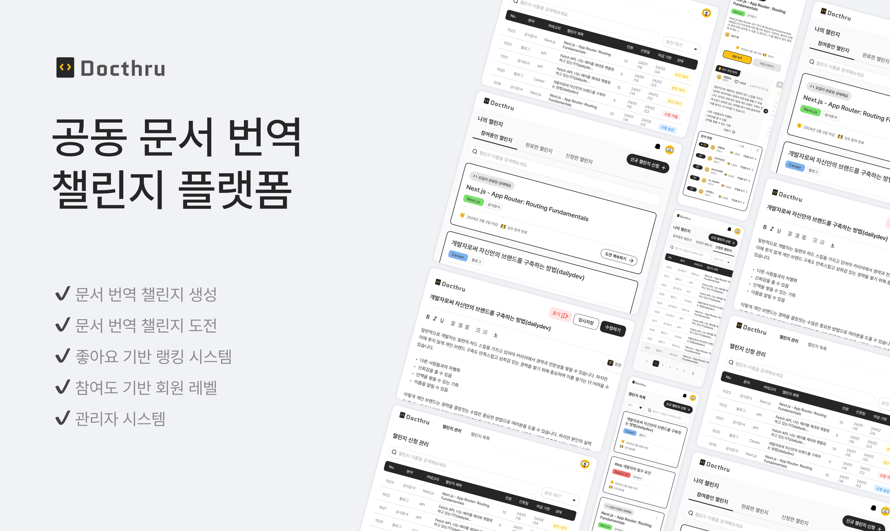
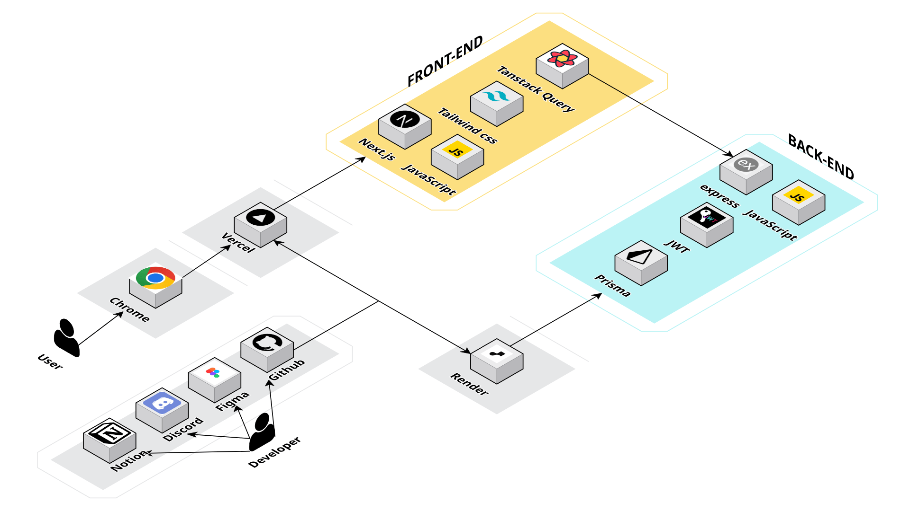
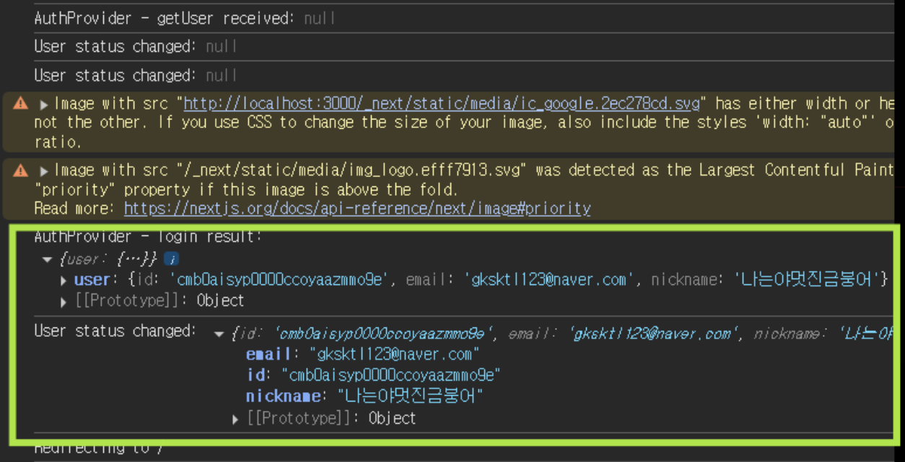
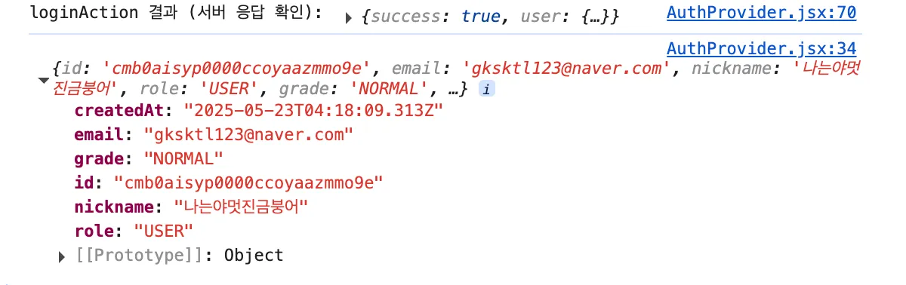

<div align="center">
  
</div>

# 어려운 영어 공식문서! 같이 공부해 보실래요? 독스루 보러가기 -> [DocThru](https://6-docthru-3team-fe.vercel.app/)

### Back-end 깃허브 [Back-end](https://github.com/JJOBO/6-Docthru-3team-BE/tree/dev)

# 📜 목차

1. [프로젝트 소개](#📝-프로젝트-소개)
2. [기능 구현 영상](#💻-기능-구현-영상)
3. [시스템 아키텍처](#🚧-시스템-아키텍쳐)
4. [기술 스택](#⚙️-기술-스택)
5. [주요 라이브러리](#📚-주요-라이브러리)
6. [팀 소개 및 문서](#👥-팀-소개-및-문서)
7. [개인별 주요 작업 내역](#📋-개인별-주요-작업-내역)
8. [프로젝트 구조](#📁-프로젝트-구조)
9. [주요 기능 상세](#🌟-주요-기능-상세)
10. [성능 최적화 전략](#🚀-성능-최적화-전략)
11. [트러블 슈팅](#💣-트러블-슈팅)

<br/>

# 📝 프로젝트 소개

- Docthru는 개발 관련 영어 문서를 함께 번역하며 성장하는 번역 챌린지 플랫폼입니다.
  혼자 보기엔 어려운 기술 문서도, 함께 번역하고 피드백을 주고받는 과정 속에서 더 쉽게 이해하고, 더 깊이 학습할 수 있도록 돕습니다.
  개발자들이 지식을 나누고 함께 성장할 수 있는 협업 기반의 번역 커뮤니티를 지향합니다.

<br/>

# 💻 기능 구현 영상

### 👤 일반 사용자

#### 1. 챌린지 참여 플로우

- 챌린지 목록 조회 및 필터링
- 원문과 번역 에디터 동시 확인
- 임시 저장 및 최종 제출
- 작업물 수정 및 관리

#### 2. 챌린지 생성 플로우

- 번역하고 싶은 문서 등록
- 챌린지 정보 입력 (제목, 분야, 문서타입)
- 마감일 및 참여 인원 설정
- 신청 현황 확인

#### 3. 챌린지 조회 플로우

- 분야별/상태별 필터링
- 제목 검색 (초성 검색 지원)
- 참여자 순위 및 추천 확인
- 마감된 챌린지의 베스트 작업물

#### 4. 피드백 시스템

- 작업물 상세 보기
- 피드백 작성 및 토론
- 추천(하트) 기능
- 알림을 통한 피드백 확인

### 👑 관리자

#### 1. 챌린지 관리

- 신규 챌린지 승인/거절
- 진행 중인 챌린지 수정
- 부적절한 챌린지 삭제

#### 2. 콘텐츠 관리

- 작업물 관리 (수정/삭제)
- 피드백 관리
- 신고 처리

<br/>

# 🚧 시스템 아키텍쳐

<div align="center">
  
</div>

<br/>

# ⚙️ 기술 스택

### ✅ Language


### ✅ Framework & Libraries


### ✅ Hosting & Deployment


### ✅ Version Control


<br/>

# 📚 주요 라이브러리

<details>
<summary>상태 관리</summary>

- **@tanstack/react-query**: 서버 상태 관리 및 캐싱
- **@tanstack/react-query-devtools**: React Query 개발자 도구
</details>

<details>
<summary>에디터</summary>

- **@tiptap/react**: 리치 텍스트 에디터 코어
- **@tiptap/starter-kit**: 기본 에디터 기능 모음
- **@tiptap/extension-bullet-list**: 글머리 기호 목록
- **@tiptap/extension-ordered-list**: 번호 매기기 목록
- **@tiptap/extension-list-item**: 목록 아이템
- **@tiptap/extension-color**: 텍스트 색상
- **@tiptap/extension-text-align**: 텍스트 정렬
- **@tiptap/extension-text-style**: 텍스트 스타일
- **@tiptap/extension-underline**: 밑줄
- **@tiptap/extension-placeholder**: 플레이스홀더
</details>

<details>
<summary>UI 컴포넌트</summary>

- **react-textarea-autosize**: 자동 크기 조절 텍스트 영역
- **react-datepicker**: 날짜 선택기
- **react-spinners**: 로딩 스피너
- **react-intersection-observer**: 무한 스크롤 구현
</details>

<details>
<summary>폼 & 데이터</summary>

- **react-hook-form**: 폼 상태 관리
- **dompurify**: HTML 새니타이징
- **dayjs**: 날짜 처리
</details>

<details>
<summary>보안</summary>

- **jose**: JWT 토큰 처리
</details>

<details>
<summary>개발 도구</summary>

- **@tailwindcss/typography**: 타이포그래피 스타일
- **prettier-plugin-tailwindcss**: Tailwind CSS 클래스 정렬
- **@eslint/eslintrc**: ESLint 설정
</details>

<br/>

# 👥 팀 소개 및 문서

## 팀원 소개

| 이름   | 역할            | GitHub                                        | 개인 개발 보고서                                                 |
| ------ | --------------- | --------------------------------------------- | ---------------------------------------------------------------- |
| 조성빈 | 🍉 팀장         | [@JJOBO](https://github.com/JJOBO/)           | [보고서](https://www.notion.so/1ec2facab63c81eca07af4d8f2bd39c0) |
| 심유빈 | 🍒 팀원         | [@shimyubin](https://github.com/shimyubin/)   | [보고서](https://www.notion.so/1f32facab63c8063af31e35ceaf5e7a8) |
| 오하영 | 🍑 팀원         | [@fiivxyxxng](https://github.com/fiivxyxxng/) | [보고서](https://www.notion.so/1f32facab63c8096b969da4f5399bd3a) |
| 김홍섭 | 🍇 백엔드마스터 | [@rakaso598](https://github.com/rakaso598/)   | [보고서](https://www.notion.so/1f32facab63c80088ad2eba91feb3155) |
| 황수정 | 🍎 팀원         | [@suejeong](https://github.com/suejeong/)     | [보고서](https://www.notion.so/1f32facab63c80b08333f61e56fa361e) |
| 김수경 | 🍊 팀원         | [@suKyoung25](https://github.com/suKyoung25/) | [보고서](https://www.notion.so/1f32facab63c806bb835c90523b6869b) |
| 박민규 | 🍈 프론트마스터 | [@gksktl111](https://github.com/gksktl111/)   | [보고서](https://www.notion.so/1f32facab63c80b4b1c0f468d3656e78) |

## 팀 문서

📝 [팀 노션](https://www.notion.so/1ec2facab63c808d9b80ca0759018768?v=1ec2facab63c8156b3aa000c4b136520)

<br/>

# 📋 개인별 주요 작업 내역

<details>
<summary>🍉 조성빈 (팀장)</summary>

## frontend

- **챌린지 카드 컴포넌트**

  - 챌린지 정보를 카드 형태로 시각적 구현
  - 카테고리/상태를 위한 chip 컴포넌트 개발
  - 참여 인원, 마감일, 드롭다운 UI 구현
  - 모바일/태블릿/PC 대응 반응형 디자인 적용

- **유저 관련 API 구조 설계**

  - 사용자 정보 조회 API 구현 (`/users/me`)
  - 나의 챌린지 목록 API 구현 (필터링, 페이지네이션)
  - 챌린지 신청 목록 API 구현
  - 서버 액션을 통한 인증 토큰 처리

- **챌린지 상세 페이지**
  - 챌린지 상세 데이터 조회 및 연동
  - 참가/마감 상태에 따른 UI 분기 처리
  - 작업물 작성 플로우 구현
  - 최다 추천 작업물 슬라이드 UI 개발
  - 랭킹 리스트 페이지네이션 구현 (5개 단위)
  - 1등 작업물 강조 표시 및 아이콘 적용
  - 상태별 조건부 UI 렌더링 (빈 상태, 마감 상태)

## backend

### 유저 API 상세 구현

#### 1. 내 정보 조회 (GET /users/me)

**동작 방식**

- 인증된 사용자의 JWT에서 userId를 추출
- DB에서 해당 유저의 기본 정보 조회

**응답 필드**

- id
- email
- nickname
- grade (NORMAL | EXPERT)
- role
- createdAt

**사용 목적**

- 프론트의 마이페이지 및 헤더 정보 구성
- 등급에 따라 UI 달리 렌더링 (예: 전문가 배지)

#### 2. 나의 챌린지 목록 조회 (GET /users/me/challenges)

**쿼리 파라미터**

- myChallengeStatus: applied, participated, completed
- keyword: 챌린지 제목 검색

**동작 방식**

- 유저의 챌린지 참여 이력(신청, 참여 중, 완료)을 구분하여 필터링
- Prisma에서 조건 조합 쿼리 작성
  - 신청: Application 기준
  - 참여: Participant 기준
  - 완료: 마감일 + 작업물 여부 기준

**사용 목적**

- 프론트에서 마이페이지 챌린지 목록 구성

#### 3. 등급 관리 (User.grade)

**등급 체계**

- 초기 등급: NORMAL
- 승격 조건: 특정 조건 만족 시 EXPERT로 승격
  // ... existing code ...

</details>

<details>
<summary>🍒 심유빈</summary>

## frontend

- **작업물 상세 페이지**

  - 작업물 수정 및 삭제 버튼 구현
  - 피드백 등록과 수정 및 삭제
  - `useInfiniteQuery`를 사용한 무한 스크롤 피드백 목록 구현
  - `useMutation`을 활용한 피드백 CRUD 및 캐시 자동 갱신

- **알림 모달**
  - 알림 내용 및 알림 일자 출력 구현
  - 읽지 않은 알림 불러오기 기능 구현
  - 알림을 클릭하여 읽음 처리 기능 구현

## backend

</details>

<details>
<summary>🍑 오하영</summary>

## frontend

- **어드민 챌린지 신청 페이지**

  - 챌린지 신청 목록 페이지: UI, 조회, 검색, 정렬 기능
  - 챌린지 신청 상세 페이지: UI, 신청 승인, 페이지 이동 기능

- **회원가입 페이지 및 소셜 로그인**

  - UI, 회원가입 API 연동, 회원가입 유효성 검사
  - 구글 로그인 BE, FE

- **나의 챌린지 페이지**

- 참여중/완료한 챌린지: 목록 조회 API 구현 및 연동, 무한스크롤, 키워드 검색 기능
- 신청한 챌린지: UI, 목록/상세 조회 API 구현 및 연동

## backend

</details>

<details>
<summary>🍇 김홍섭</summary>

## frontend

- **기초 프로젝트 세팅 및 공통 컴포넌트 분할**

  - 프로젝트의 주요 라우팅 및 구조 설계 공통 컴포넌트 분할

- **관리자 작업물/피드백 관리**

  - 관리자 권한 사용자의 작업물 및 피드백 CRUD 기능 구현
  - 다른 사용자의 작업물과 피드백을 직접 수정/삭제할 수 있는 권한 관리

## backend

- **데이터베이스 및 스키마 관리**

  - Render 배포 환경의 PostgreSQL 데이터베이스 구축 및 관리
  - Express + Prisma ORM 기반의 데이터베이스 인터페이스 구현
  - 팀원 피드백 기반 스키마 지속적 개선 및 최적화
  - 목(Mock) 데이터 시딩을 위한 데이터 구조 설계 및 구현

- **백엔드 레포지토리 초기화**
  - Express 기본 설정 및 필수 라이브러리 구성
  - 데이터베이스 연결 및 환경 변수 설정
  - 프로젝트 요구사항에 맞는 폴더 구조 설계
  - 팀 개발을 위한 백엔드 기반 환경 구축

</details>

<details>
<summary>🍎 황수정</summary>

## frontend

- **나의 챌린지 페이지 제작 및 컴포넌트**

  - 내가 소속되어있는 챌린지를 조회하고 생성한 챌린지에 대한 심사과정을 확인할 수 있는 영역
    - `MyChallenges`: 챌린지를 검색하고 리스트를 조회할 수 있는 화면 관련 컴포넌트
    - `MyApplicationsPage`: 신청 목록을 조회하고 챌린지 신청 상태를 조회할 수 있는 페이지
    - `AppliedChallenges`: 지원한 챌린지 리스트 컴포넌트

- **챌린지 상세 조회, 챌린지 수정 API 연결**

## backend

</details>

<details>
<summary>🍊 김수경</summary>
 
 ## frontend 
- **챌린지 목록 조회**
  - 필터를 통해 챌린지의 분야, 문서타입, 진행 상태 별로 데이터를 조회
  - 검색어를 통해 데이터를 조회 (초성, 띄어쓰기 적용 가능)

- **챌린지 생성**
  - 챌린지 데이터 정보를 입력하여 챌린지를 생성할 수 있음
  - UX를 고려한 각 input에 에러 메세지 적용

## backkend

- **챌린지 조회 쿼리**
  - 다중 쿼리 스트링을 이용하여 중복되는 필터의 목록을 가져올 수 있음
  - 검색어를 initial로 분해하여 초성 검색 가능
  - 쿼리 전송 시 띄어쓰기와 관계없이 데이터를 불러올 수 있음

</details>

<details>
<summary>🍈 박민규</summary>

## frontend

- **작업물 form 페이지**

  - TipTap 기반 문서 에디터 기능: bold, italic, underline, 정렬, 리스트, 텍스트 컬러 등
  - 작업물 CRUD 기능 연결
  - 로컬스토리지 임시 저장 및 단축키(`Ctrl + S`, `Cmd + S`) 기능
  - iframe을 통한 원본 사이트 확인 사이드 모달 구현
  - UX 향상을 위한 에러처리 모달 및 애니메이션 적용

- **refreshToken을 이용한 액세스 토큰 재발급 및 자동 로그인**
  - refreshToken이 있으면 자동 로그인 처리
  - 프론트: 타이머 함수를 활용하여 14분 간격으로(만료가 15분이기 때문) refreshToken을 전달해 accessToken 재발급

## backend

- **작업물 관련 CRUD**
  - "works/" 관련 api 설계
  - 레이어 아키텍쳐를 준수한 작업물 CRUD 구현
  - prisma를 사용한 DB 관리 및 트랜잭션을 활용한 최적화 진행
- **JWT 슬라이딩 세션**
  - refreshToken 기반 JWT 슬라이딩 세션 적용

</details>

<br/>

# 📁 프로젝트 구조

```
src/
├── app/              # Next.js 페이지 및 라우팅
│   ├── (auth)/        # 인증 관련 페이지
│   ├── (challenge)/   # 챌린지 관련 페이지
│   └── admin/       # 관리자 페이지
├── assets/           # 이미지, 폰트 등 정적 자산
├── components/       # 재사용 가능한 공용 컴포넌트
├── constant/         # 상수 및 설정 값
├── hooks/           # 커스텀 훅
│   ├── api/        # API 관련 훅
│   └── common/     # 공통 기능 훅
├── layout/          # 레이아웃 컴포넌트
├── lib/             # 유틸리티 함수 및 api
│   ├── api/        # API 관련 설정 및 인터페이스
│   └── utils/      # 유틸리티 함수
├── providers/       # 인증 및 React Query Provider
└── middleware.js    # Next.js 미들웨어 (인증/인가 처리)
```

<br/>

# 🌟 주요 기능 상세

<details>
<summary>1. 인증 시스템</summary>

- **회원가입/로그인**
  - 이메일 기반 회원가입 및 로그인
  - Google OAuth 소셜 로그인 지원
- **사용자 등급 시스템**
  - 일반 등급: 기본 등급으로 부여
  - 전문가 등급: 다음 조건 중 하나 충족 시 자동 승급 - 챌린지 참여 5회 이상 + 추천 선정 5회 이상 - 챌린지 참여 10회 이상 - 추천 선정 10회 이상
  </details>

<details>
<summary>2. 번역 챌린지</summary>

- **챌린지 조회**

  - 목록 조회: 제목, 분야, 문서타입, 마감일, 상태, 참여 인원 등
  - 검색 및 필터링: 제목 검색, 분야/문서타입/상태 필터
  - 상세 조회: 원문 보기, 참여 현황, 순위 등

- **챌린지 참여**

  - 도전하기: 마감 전 챌린지 참여
  - 번역 작성: 에디터 제공, 임시 저장 기능
  - 원문 조회: 임베디드 원문 확인
  - 작업물 관리: 임시 저장, 불러오기, 제출

- **챌린지 신청 및 관리**
  - 신규 챌린지 신청: 문서 정보, 마감일, 인원 설정
  - 어드민 관리: 승인/거절, 수정, 삭제 기능
  - 작업물/피드백 관리: 수정, 삭제 권한 관리
  </details>

<details>
<summary>3. 작업물 및 피드백</summary>

- **작업물 관리**

  - 상세 조회: 번역 내용, 피드백, 추천 수 확인
  - 피드백 작성: 무한 스크롤 피드백 목록
  - 추천 시스템: 작업물 하트 기능

- **나의 챌린지**
  - 참여 중인 챌린지: 진행 중인 챌린지 목록, 작업물 수정
  - 완료한 챌린지: 마감된 챌린지, 제출 번역문 조회
  - 신청 챌린지: 승인 상태 확인, 신청 취소 기능
  </details>

<details>
<summary>4. 알림 시스템</summary>

- **변경사항 알림**

  - 작업물/챌린지/피드백 수정/삭제 알림
  - 상태 변경 날짜 포함

- **챌린지 관련 알림**

  - 승인/거절/삭제 알림
  - 새로운 작업물 알림
  - 새로운 피드백 알림
  - 마감 알림

- **알림 관리**
  - 읽음 처리 기능
  - 어드민 처리 알림 (수정/삭제 사유 포함)
  </details>

<br/>

# 🚀 성능 최적화 전략

<details>
<summary>1. 초기 로딩 최적화</summary>

- **코드 스플리팅**

  - 동적 임포트를 통한 컴포넌트 분할
  - 페이지 단위 코드 분할
  - 라이브러리 선택적 로딩

- **리소스 최적화**
  - `next/image`를 통한 이미지 자동 최적화
  - 폰트 최적화 (`next/font`)
  - 정적 자산 캐싱

</details>

<details>
<summary>2. 렌더링 성능</summary>

- **서버 사이드 최적화**

  - 정적 페이지 생성 (SSG)
  - 서버 컴포넌트 적극 활용

- **클라이언트 사이드 최적화**
  - `React.memo`를 통한 불필요한 리렌더링 방지
  - 이벤트 핸들러 최적화

</details>

<details>
<summary>3. 데이터 관리</summary>

- **캐싱 전략**

  - React Query 캐시 활용
  - 브라우저 캐시 정책

- **데이터 프리페칭**
  - 라우트 프리페칭
  - 데이터 프리로딩

</details>

<details>
<summary>4. 사용자 경험</summary>

- **로딩 상태 처리**

  - 스켈레톤 UI
  - 로딩 스피너

- **인터랙션 최적화**
  - 디바운싱 / 쓰로틀링
  - 지연 로딩
  - 무한 스크롤

</details>

<details>
<summary>5. 모니터링 및 분석</summary>

- **성능 메트릭스**

  - Core Web Vitals
  - Lighthouse 점수
  - 사용자 정의 메트릭

- **에러 추적**
  - 에러 바운더리
  - 에러 로깅
  - 성능 모니터링

</details>

<br/>

# 💣 트러블 슈팅

<details>
<summary>1. [챌린지] 리프레시 토큰 만료 이슈</summary>

## 🔍 문제 상황

리프레시 토큰이 만료되었을 때 사용자가 자동으로 로그아웃되지 않고, 무한 로딩 상태에 빠지는 현상이 발생

## ❓ 원인 분석

- 리프레시 토큰 만료 시 처리 로직 부재
- 에러 핸들링이 제대로 이루어지지 않음
- 사용자에게 적절한 피드백이 제공되지 않음

## ✅ 해결 방법

<div align="center">
  
</div>

1. **토큰 만료 확인 로직 추가**

   ```typescript
   const checkTokenExpiration = (token: string) => {
     // 토큰 만료 체크 로직
   };
   ```

2. **에러 핸들링 개선**

   - 만료 시 자동 로그아웃 처리
   - 사용자에게 알림 메시지 표시

3. **결과**
   - 토큰 만료 시 자동 로그아웃 및 로그인 페이지 리다이렉트
   - 사용자 경험 개선
   </details>

<details>
<summary>2. [작업물] 임시 저장 시 사용자 피드백 부족</summary>

## 🔍 문제 상황

- 사용자는 `Ctrl/Cmd + S` 단축키로 **작업물을 임시 저장**할 수 있도록 설계했으나, 저장이 완료되었는지 여부를 **직관적으로 인지할 수 있는 시각적 피드백이 부족**
- 피드백이 없을경우 사용자는 **"정말 저장이 된 건가?"** 라는 불확실함을 경험함
- 노션의 저장 UI에서 영감을 얻어 구현

## ✅ 해결 방법

<div align="center">
  
</div>

1. **로딩 스피너 기반 피드백 구현**

   ```typescript
   // useDraft 훅 내부 (임시 저장 중 로딩 피드백 처리)
   updateDraftState("isDrafting", true); // 스피너 표시 시작

   // 로컬스토리지 저장 로직 수행

   timeoutRef.current = setTimeout(() => {
     updateDraftState("isDrafting", false); // 800ms 뒤 스피너 종료
   }, 800);
   ```

2. **시각적 피드백 처리**
   - 임시 저장 동작 시점에 **로딩 스피너를 잠시 표시**하여 저장 진행 상태 전달
   - 로컬스토리지 저장의 즉각성을 고려한 인위적 대기 시간(`setTimeout`) 구현
   - 스피너는 최소 800ms 이상 유지되어 **저장 완료 과정을 시각적으로 인지 가능**하게 함

## 🎯 개선 효과

- 저장 동작에 대한 **즉각적이고 확실한 피드백** 제공
- 사용자는 로딩 스피너를 통해 **"지금 저장 중이구나" → "저장 완료" 흐름을 명확하게 인지**
- 빠르게 반복되는 작업 흐름에서도 **심리적 안정감과 시스템 신뢰성** 확보
</details>

<details>
<summary>3. [어드민] 유저 정보 조회 에러</summary>

## 🔍 문제 상황

<div align="center">
  
</div>

- 로그인 시 accessToken은 `HttpOnly` 쿠키로 저장되지만, 유저 정보 조회 요청 시 accessToken을 읽지 못해 인증 실패
- 클라이언트에서 `credentials: "include"` 로 쿠키를 자동 전송했지만, 여전히 유저 정보 조회 시 role, grade 등의 정보가 누락됨
- 백엔드에서 토큰 누락으로 인증 실패 처리되어 401 에러 발생

## ❓ 원인 분석

1. **쿠키 접근 제한**

   - `HttpOnly` 쿠키는 클라이언트(`document.cookie`)에서 직접 접근 불가
   - 기존 방식처럼 클라이언트에서 accessToken을 꺼내 `Authorization` 헤더로 전달할 수 없음

2. **토큰 전달 실패**
   - accessToken은 쿠키에 있지만 클라이언트가 읽을 수 없어 헤더에 넣지 못함
   - 백엔드는 토큰이 누락된 것으로 판단하여 인증 실패 처리

## ✅ 해결 방법

<div align="center">
  
</div>

1. **컴포넌트 계층 구조 재설계**

   - 서버 액션(`getUserAction`) → 서버 컴포넌트(`UserService`) → 클라이언트 컴포넌트(`AuthProvider`) 로직 분리
   - 각 계층의 역할과 책임을 명확히 구분

2. **서버 액션에서 토큰 처리**

   ```typescript
   const getUserAction = async () => {
     const cookies = headers().get("cookie");
     // 서버 액션에서 쿠키를 읽어 요청 헤더에 수동 삽입
     const response = await fetch(`${API_URL}/users/me`, {
       method: "GET",
       headers: {
         "Content-Type": "application/json",
         Cookie: `accessToken=${accessToken}`
       }
     });
     // ... 응답 처리
   };
   ```

3. **결과**
   - 서버 액션에서 안전하게 쿠키 접근 및 토큰 처리
   - 클라이언트는 서버 액션의 결과로 받은 유저 정보 사용
   - 보안성을 유지하면서도 정상적인 인증 플로우 구현
   </details>
